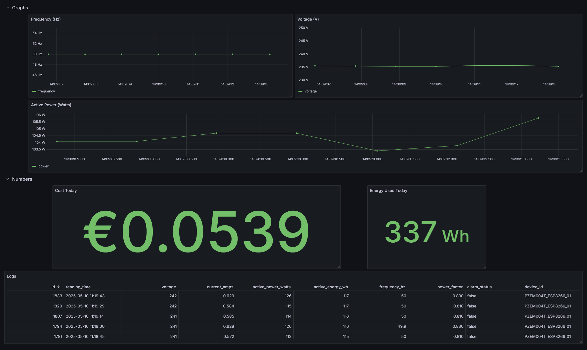

# ESP8266 PZEM-004T Energy Monitor with PostgreSQL & Grafana

<p align="left">
  <a href="https://www.arduino.cc/" target="_blank" rel="noreferrer"></a>
  <a href="https://www.espressif.com/en/products/socs/esp8266" target="_blank" rel="noreferrer"></a>
  <a href="https://www.cplusplus.com/" target="_blank" rel="noreferrer"></a>
  <a href="https://www.python.org" target="_blank" rel="noreferrer"></a>
  <a href="https://flask.palletsprojects.com/" target="_blank" rel="noreferrer"></a>
  <a href="https://www.postgresql.org" target="_blank" rel="noreferrer"></a>
  <a href="https://grafana.com/" target="_blank" rel="noreferrer"></a>
  <a href="https://www.docker.com/" target="_blank" rel="noreferrer"></a>
  <a href="https://docs.docker.com/compose/" target="_blank" rel="noreferrer"></a>
  <a href="https://www.json.org/json-en.html" target="_blank" rel="noreferrer"></a>
  <a href="https://platformio.org/" target="_blank" rel="noreferrer"></a>
</p>

This project demonstrates how to read electrical data (Voltage, Current, Power, Energy, Frequency, Power Factor) from a PZEM-004T v4.0 (Modbus version) energy monitor using an ESP8266, send this data to a Python Flask application, store it in a PostgreSQL database, and visualize it with Grafana. The entire backend (PostgreSQL, Python Ingester, Grafana) is designed to run using Docker.



## Features

*   **Sensor Reading:** ESP8266 reads data from PZEM-004T via Modbus RTU over SoftwareSerial.
*   **Data Transmission:** ESP8266 sends data in JSON format over Wi-Fi via HTTP POST.
*   **Data Ingestion:** A Python Flask application receives the data and stores it.
*   **Database Storage:** PostgreSQL is used to store time-series energy data.
*   **Data Visualization:** Grafana provides dashboards to view real-time and historical energy metrics.
*   **Containerized Backend:** PostgreSQL, Python Ingester, and Grafana are managed with Docker Compose for easy setup and deployment.

## Project Structure

```
power_monitor/
├── esp8266_pzem_reader/       # Arduino sketch for ESP8266
│   └── main.c
├── ingester_app/              # Python Flask application for data ingestion
│   ├── app.py
│   ├── Dockerfile
│   └── requirements.txt
├── .env                       # Environment variables for Docker Compose (passwords, etc.)
├── docker-compose.yml         # Docker Compose configuration
└── readme.md                  # This file
```

## Prerequisites

*   **Hardware:**
    *   ESP8266 (e.g., NodeMCU, Wemos D1 Mini, etc)
    *   PZEM-004T v4.0 (Modbus version) energy monitor with CT coil
    *   Appropriate wiring (ensure safety when dealing with 220 ac voltage)
    *   USB cable for ESP8266 programming
    *   Wi-Fi network
*   **Software (Host Machine):**
    *   Arduino IDE or PlatformIO for ESP8266 programming
    *   Docker Desktop (or Docker Engine + Docker Compose on Linux)
    *   A text editor (e.g., VS Code)
    *   Git (optional, for version control)
    *   (If running Ingester App outside Docker for dev) Python 3.7+ and `pip`

## Setup and Installation

### 1. Hardware Setup

*   **WARNING: Working with mains voltage is dangerous. Please ensure you understand the risks and take appropriate safety precautions. If unsure, consult a qualified electrician.**
*   Connect the PZEM-004T to your mains line and the load you want to monitor according to its manual.
*   Connect the PZEM-004T's Modbus TTL serial interface to the ESP8266:
    *   PZEM TX -> ESP8266 RX pin (e.g., D5 / GPIO14 on NodeMCU)
    *   PZEM RX -> ESP8266 TX pin (e.g., D6 / GPIO12 on NodeMCU)
    *   PZEM 5V -> ESP8266 5V/VIN (if available and PZEM needs it, check PZEM version)
    *   PZEM GND -> ESP8266 GND

The firmware for the ESP8266 is written in C++ using the Arduino framework. It reads data from the PZEM-004T sensor and sends it to the backend server.

**Source File:** `esp8266_pzem_reader/main.c`

**Required Libraries:**

*   `SoftwareSerial.h` (Part of ESP8266 core, no separate install needed)
*   `ModbusMaster.h`
*   `ESP8266WiFi.h` (Part of ESP8266 core)
*   `ESP8266HTTPClient.h` (Part of ESP8266 core)
*   `ArduinoJson.h`

**Configuration within `main.c`:**

Before compiling and uploading, you **must** configure the following constants at the top of the `.c` file:

```cpp
// --- WiFi Credentials ---
const char* ssid = "YOUR_WIFI_SSID";
const char* password = "YOUR_WIFI_PASSWORD";

// --- Server Details ---
const char* serverHost = "YOUR_SERVER_HOST_IP"; // e.g., "192.168.1.100"
const int serverPort = 5000;
```

### 3. Backend Setup (Docker)

1.  **Clone the repository (if you haven't):**
    ```bash
    git clone git@github.com:itsnova204/power_monitor.git
    cd power_monitor
    ```
2.  **Create Environment File:**
    *   Edit `.env` at the root of the `power_monitor` directory.
    *   `power_monitor/.env`:
        ```env
        # PostgreSQL Credentials
        POSTGRES_USER=pzemuser
        POSTGRES_PASSWORD=your_strong_postgres_password # CHANGE THIS
        POSTGRES_DB=pzemdata

        # Grafana Admin Password
        GF_ADMIN_PASSWORD=your_strong_grafana_admin_password # CHANGE THIS

        # Flask settings
        FLASK_DEBUG=1 # 1 for development, 0 for production
        ```
    *   **Replace placeholder passwords.**
3.  **Build and Run Docker Containers:**
    *   Navigate to the `power_monitor` directory in your terminal.
    *   Run the command:
        ```bash
        docker-compose up --build -d
        ```
        *   `--build`: Builds the `ingester_app` image if it's the first time or if its `Dockerfile` or source files changed.
        *   `-d`: Runs the containers in detached mode (in the background).

4.  **Verify Containers are Running:**
    ```bash
    docker-compose ps
    ```
    You should see `pzem_postgres_db`, `pzem_ingester_app`, and `pzem_grafana` with `State: Up`.

### 4. Configure Grafana

1.  **Access Grafana:** Open your web browser and navigate to `http://localhost:3000`.
2.  **Login:**
    *   Username: `admin`
    *   Password: The `GF_ADMIN_PASSWORD` you set in your `.env` file.
3.  **Add PostgreSQL Data Source:**
    *   Configuration (gear icon) -> Data sources -> Add new data source.
    *   Select "PostgreSQL".
    *   **Settings:**
        *   Name: `PZEM_PostgreSQL` (or similar)
        *   Host: `postgres_db:5432` (service name from `docker-compose.yml`)
        *   Database: `pzemdata` (value from `.env`)
        *   User: `pzemuser` (value from `.env`)
        *   Password: The `POSTGRES_PASSWORD` from `.env`.
        *   SSL Mode: `disable`
        *   PostgreSQL version: `12+` (or select your version)
    *   Click "Save & test". You should see a success message.
4.  **Import or Create Dashboards:**
    *   You can create new dashboards and panels manually.
    *   *(Optional: If you export a dashboard as JSON, you can provide instructions here on how to import it.)*
    *   **Example Query for a Time Series Panel (e.g., Active Power):**
        ```sql
        SELECT
          reading_time AS "time",
          active_power_watts AS power
        FROM
          sensor_readings
        WHERE
          $__timeFilter(reading_time)
        ORDER BY
          reading_time ASC;
        ```
    *   Set panel title, units, and other visualization options as desired. Remember to set the dashboard's **Timezone** (Dashboard Settings -> General -> Time options) to "Local browser time" or your specific timezone for correct display.

## Usage

*   Once the ESP8266 is running and sending data, and the Docker containers are up, data should start populating the PostgreSQL database.
*   Open Grafana (`http://localhost:3000`) to view your dashboards.
*   Set the dashboard time range (e.g., "Last 15 minutes") and auto-refresh interval (e.g., "10s") for live monitoring.

## Troubleshooting

*   **ESP8266 not sending data:**
    *   Check Wi-Fi connection.
    *   Verify `serverHost` IP and port `5000`.
    *   Check Serial Monitor for errors or HTTP response codes.
*   **Ingester app not receiving data or errors:**
    *   `docker-compose logs -f ingester_app`
    *   Check for Python errors, database connection issues.
    *   (WSL2 users) Verify `netsh` port forwarding is correct and active.
    *   Ensure no firewall on the host machine is blocking port `5000`.
*   **No data in Grafana / Grafana panels empty:**
    *   Verify data is being written to PostgreSQL directly (using DBeaver, pgAdmin, or `psql`). Query: `SELECT * FROM sensor_readings ORDER BY reading_time DESC LIMIT 10;`
    *   Check Grafana data source configuration.
    *   Use Grafana's Query Inspector to see the exact query being sent and the raw data returned.
    *   Ensure dashboard time range and timezone settings are appropriate (timestamps in DB are UTC).
*   **Docker Compose errors on startup:**
    *   Check `docker-compose.yml` syntax.
    *   Ensure required ports (5432, 5000, 3000) are not already in use on your host.


## License

[MIT](https://choosealicense.com/licenses/mit/) Copyright © 2025 Tiago Aleixo
